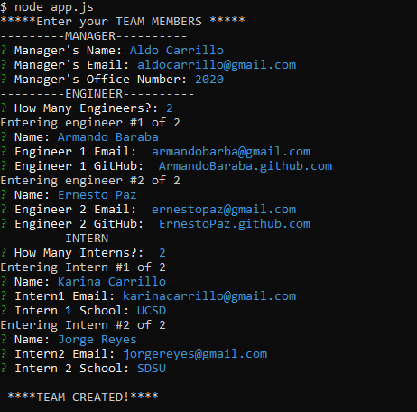
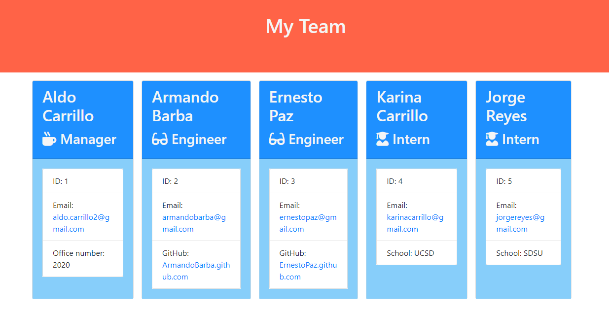
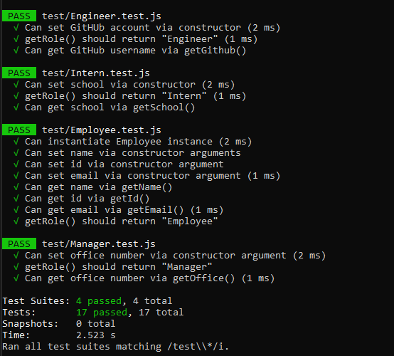

# HM10-EmployeeSummary

### Application Link:  https://aldocarrillo.github.io/HW10-EmployeeSummary/output/team.html

## Description
This project can be use to create a better view of each member of your working team, here you can add a Manager, X quantity of Engineer and X quantity of Interns.
You can add the info of each member in a html file, you can open this in the browser to get a gobal view of your team.

## Table of contents

* [Installation](#installation)
* [Usage](#usage)
* [Credits](#credits)
* [License](#license)
* [Questiones](#Questiones)

## Installation
Run the terminal the main file called "app.js" with Node.

## Usage 
To create you team, need to answer some question about each role.

#### Manager
    * Name
    * Email
    * Office Number

#### Engineer
    * Name
    * Email
    * Github

#### Intern
    * Name
    * Email
    * School

## Test
"Node app.js"

"Name of Manager:" Aldo Carrillo

"Email:" aldo.carrillo22@gmail.com

"Office Number: " 2020

## Input Data Example 

### HTML OUTPUT

### Test Example

## Credits
* Aldo Carrillo 

## License

MIT License

Copyright (c)   2020 Aldo Carrillo

Permission is hereby granted, free of charge, to any person obtaining a copy
of this software and associated documentation files (the "Software"), to deal
in the Software without restriction, including without limitation the rights
to use, copy, modify, merge, publish, distribute, sublicense, and/or sell
copies of the Software, and to permit persons to whom the Software is
furnished to do so, subject to the following conditions:

The above copyright notice and this permission notice shall be included in all
copies or substantial portions of the Software.

THE SOFTWARE IS PROVIDED "AS IS", WITHOUT WARRANTY OF ANY KIND, EXPRESS OR
IMPLIED, INCLUDING BUT NOT LIMITED TO THE WARRANTIES OF MERCHANTABILITY,
FITNESS FOR A PARTICULAR PURPOSE AND NONINFRINGEMENT. IN NO EVENT SHALL THE
AUTHORS OR COPYRIGHT HOLDERS BE LIABLE FOR ANY CLAIM, DAMAGES OR OTHER
LIABILITY, WHETHER IN AN ACTION OF CONTRACT, TORT OR OTHERWISE, ARISING FROM,
OUT OF OR IN CONNECTION WITH THE SOFTWARE OR THE USE OR OTHER DEALINGS IN THE
SOFTWARE.

## Questiones

* GitHub link: https://github.com/AldoCarrillo
* Email: aldo.carrillo22@gmail.com

